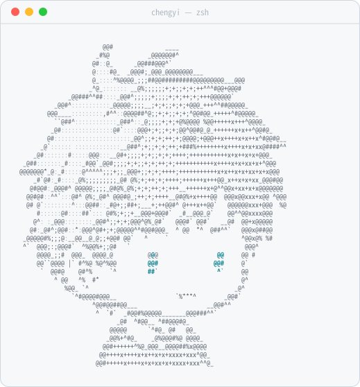

<picture>
  <source media="(prefers-color-scheme: dark)" srcset="dark_mode.svg">
  
</picture>

## 你好，我是程意 👋

为创作者构建开源 AI Agent 技能。

### 🧰 Projects

- 🎬 [native-subtitle-quote-image](https://github.com/chengyi-ai/native-subtitle-quote-image) — 保留视频原生字幕，精确取帧，拼成 3:4 社交长图
- 🖼️ [cy-carousel-skill](https://github.com/chengyi-ai/cy-carousel-skill) — 给一个选题，做成封面＋10 页的图文轮播
- 📤 [douyin-image-post-scheduler](https://github.com/chengyi-ai/douyin-image-post-scheduler) — 抖音图文批量排期、定时发布、发布后核验

### 📫 找到我

[小红书](https://www.xiaohongshu.com/user/profile/648c0e99000000001001f148) · [X](https://x.com/ChengYi3629)

