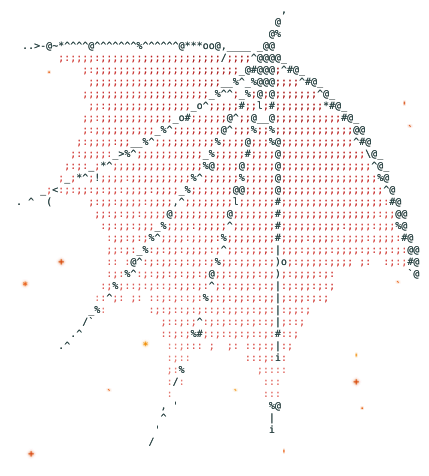
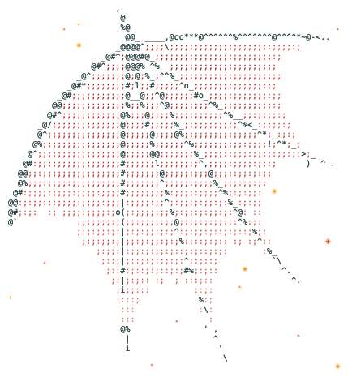

## 👋 你好，我是程意

     

为创作者构建开源 AI Agent 技能。我做内容，也把自己做内容的流程拆成一个个能复用的 Agent Skill：从视频里取帧做字幕长图，到给一个选题生成整套图文轮播，再到抖音图文的批量排期和发布。这些工具在 Claude Code、Codex 里说一句话就能调用。

<picture><source media="(prefers-color-scheme: dark)" srcset="wing-v4-left-dark.svg"></picture><picture><source media="(prefers-color-scheme: dark)" srcset="avatar-v4-dark.svg"></picture><picture><source media="(prefers-color-scheme: dark)" srcset="wing-v4-right-dark.svg"></picture>

### 🧰 Projects

- 🎬 [native-subtitle-quote-image](https://github.com/chengyi-ai/native-subtitle-quote-image) — 保留视频原生字幕，精确取帧，拼成 3:4 社交长图
- 🖼️ [cy-carousel-skill](https://github.com/chengyi-ai/cy-carousel-skill) — 给一个选题，做成封面＋10 页的图文轮播
- 📤 [douyin-image-post-scheduler](https://github.com/chengyi-ai/douyin-image-post-scheduler) — 抖音图文批量排期、定时发布、发布后核验

Follow me on:  
